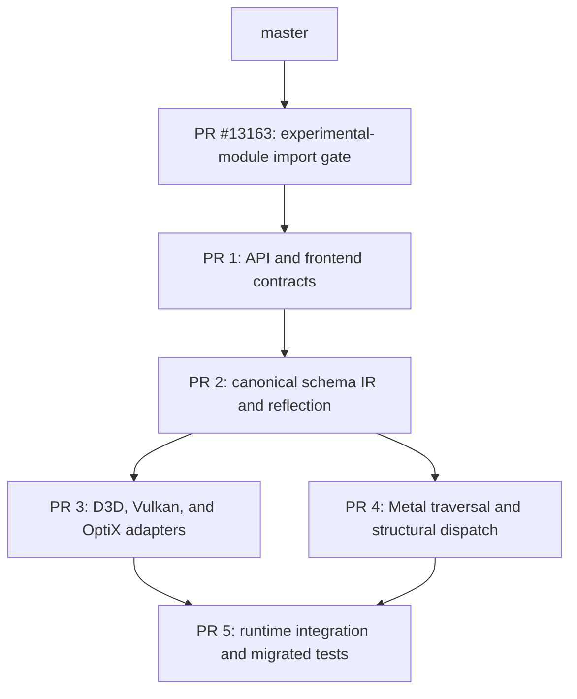

# Structural Ray Tracing Code Review Strategy

Status: PR 1 is reconstructed from current `master` and ready for API/frontend review.

| Artifact                                                                                                                           | Purpose                                               | Status                                                |
| ---------------------------------------------------------------------------------------------------------------------------------- | ----------------------------------------------------- | ----------------------------------------------------- |
| [Issue #13162](https://github.com/shader-slang/slang/issues/13162) / [PR #13163](https://github.com/shader-slang/slang/pull/13163) | Enforce experimental-module import gates consistently | Independent prerequisite; review and merge first      |
| [Fork PR #24](https://github.com/kaizhangNV/slang/pull/24)                                                                         | Structural ray-tracing API and frontend contracts     | PR 1; checkpoint `5594bfc66`                          |
| [Draft PR #12691](https://github.com/shader-slang/slang/pull/12691)                                                                | Complete implementation reference                     | Keep open as a reference; do not review as one change |

The design documents remain only on the archive branch. They are not in PR 1's history or diff.

## 1. Issue Policy

File a separate compiler issue only when both conditions hold:

1. The problem reproduces through public behavior on current `master`, without structural
   ray-tracing code.
2. A standalone regression test fails before the feature is introduced.

Otherwise, the problem is an implementation gap in the feature slice that introduces the
behavior. Fix it in that PR instead of creating a separate issue.

### Current Classification

- #13162 satisfies the rule. It affects ordinary experimental modules and its fix can merge
  independently. PR 1 is stacked on that fix until it lands.
- #12692 is independently reproducible, but module dumping is not required by PR 1. It is not a
  blocker.
- The former structural-only issues were gaps found while the feature was incomplete. Their final
  behavior and tests belong in the relevant structural PR, not in prerequisite PRs.
- `slang-rhi` changes for shader-record data and runtime validation remain separate work for the
  later runtime slice. They do not block API/frontend review.

## 2. Review Stack

Each PR should answer one reviewer question. Target-specific and RHI changes must not flow backward
into the API/frontend slice.

## 3. PR 1: API And Frontend Contracts

Reviewer question: Is the source API coherent, and can the frontend enforce its contracts without
target lowering?

PR 1 includes:

- the explicitly imported, experimental `slang.raytracing` module;
- the dynamic program-schema API, stage interfaces, contexts, inputs, primitives, motion choices,
  descriptors, and source trace operations;
- sealed compiler-owned marker sets and explicit `in` stage-input views;
- trusted stage-interface identities, structural entry-point lookup, and struct-name entry-point
  selection;
- frontend checks for context agreement, legal stage/input use, structural-type escape, mixed API
  use, and target capabilities;
- the minimum IR identity and metadata needed to preserve a selected structural entry point; and
- focused source, diagnostic, capability, entry-point, trust, and IR-identity tests.

PR 1 excludes:

- canonical schema completion after linking and public SBT reflection;
- target adapter synthesis, descriptor materialization, legalization, or emission;
- D3D, Vulkan, OptiX, Metal, and `slang-rhi` behavior;
- runtime tests; and
- design documents.

The standard-module and compiler changes stay together in PR 1. The compiler identities and checks
are what make the source interfaces closed, selectable as entry points, and safe to use; a
source-only PR would expose declarations that the compiler could not yet enforce or compile as
intended.

Suggested review order:

1. `source/standard-modules/raytracing/`: public contracts.
2. `slang-structural-ray-tracing.*` and frontend checks: trusted identities and validation.
3. entry-point and IR changes: selection and preservation only.
4. `tests/ray-tracing-2/frontend/`: observable behavior.

## 4. Later Slices

### PR 2: Canonical Schema IR And Reflection

Discover closed and open schemas after linking, build one target-neutral program description, and
expose the reflection data needed to construct an SBT. This slice owns payload selection, reachable
program retention, and schema serialization.

### PR 3: Portable Target Adapters

Generate stage adapters and demand-driven native signatures, then lower trace, callable, payload,
attribute, and record operations through existing D3D, Vulkan, and OptiX facilities.

### PR 4: Metal Traversal And Dispatch

Materialize Metal descriptor resources, infer the tag list, configure runtime ray flags, and
generate miss, closest-hit, candidate-processing, callable, motion, and multilevel dispatch.

### PR 5: Runtime Integration

Consume the compiler reflection in host code, land independently reviewable `slang-rhi` support,
integrate the existing Slang ray-tracing tests under the new API, and add platform runtime coverage.

## 5. PR 1 Readiness Record

PR 1 is one checkpoint commit on PR #13163 and is rebased on `master` commit `ebf1c81c3`.

- Release `slang-test` build passed with four build jobs.
- `tests/ray-tracing-2`: 79/79 passed.
- Structural entry-point and experimental-module unit regressions: 5/5 passed.
- Focused generic entry-point regressions: 13/13 passed.
- Formatting and `git diff --check` passed.
- All review threads are answered and resolved.
- The worktree is clean, and the diff contains no design, demo, RHI, or runtime files.

After #13163 lands, retarget PR 1 to `master`. Begin PR 2 only after the public source contracts and
trusted frontend identities in PR 1 are stable.
